# Master's Thesis: System Diagrams & Visualizations

*Note: These diagrams are written using Mermaid.js syntax. When viewed on GitHub, they will automatically render into high-quality, scalable graphics perfect for our PowerPoint presentation and Thesis Appendices.*

---

## 1. High-Level Smart Home Network Topology
*Visualizes the physical and digital boundaries of the cyber range.*

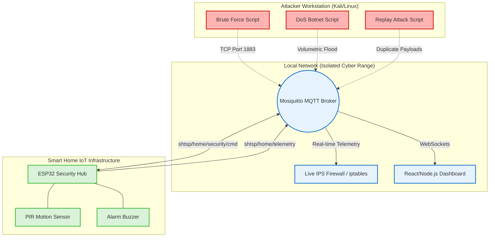

---

## 2. Threat Model & Attack Vectors
*Shows how the three different attacks target the core pillars of IoT Security.*

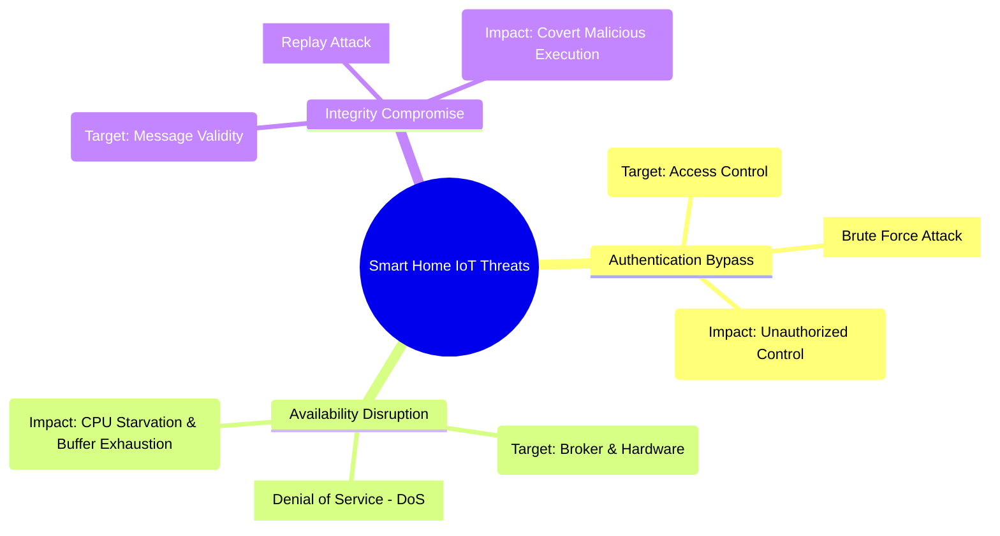

---

## 3. MQTT Topic & Message Routing Architecture
*Illustrates the Publish/Subscribe architecture of the system.*

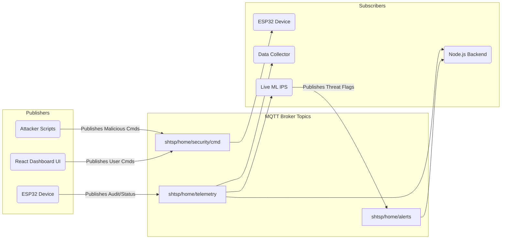

---

## 4. Hardware Logic Flow (ESP32 Security Hub)
*Shows the internal execution loop of the physical smart home device.*

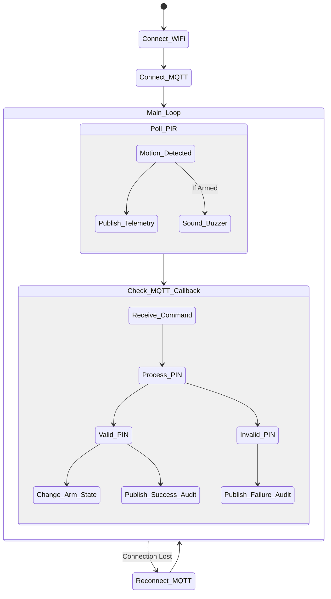

---

## 5. Volumetric DoS Attack & Hardware Starvation Sequence
*Visualizes how the DoS attack causes the ESP32 to drop valid physical events.*

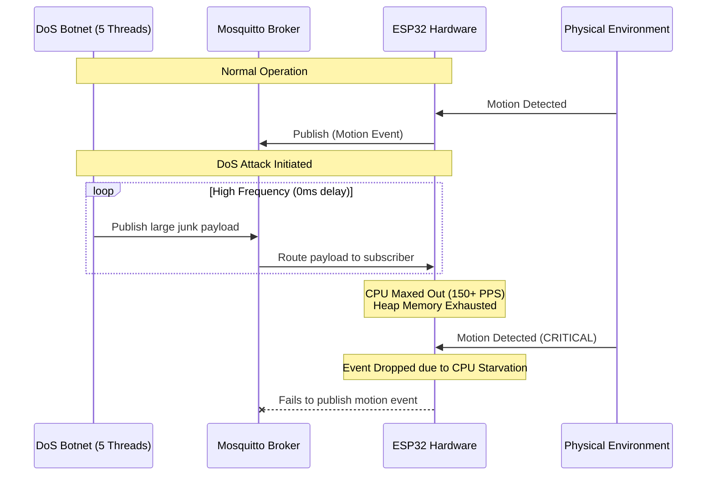

---

## 6. Replay Attack Capture & Retransmission Sequence
*Shows the stealthy nature of the Replay attack bypassing traditional security.*

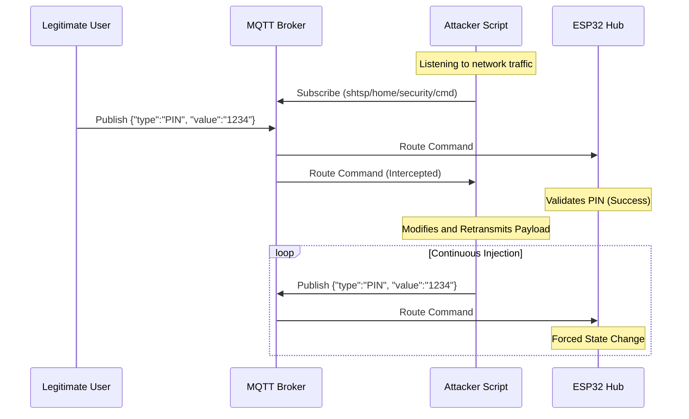

---

## 7. Unified Dataset Engineering Pipeline
*The exact process of turning raw telemetry into the 1.6 Million row ML dataset.*

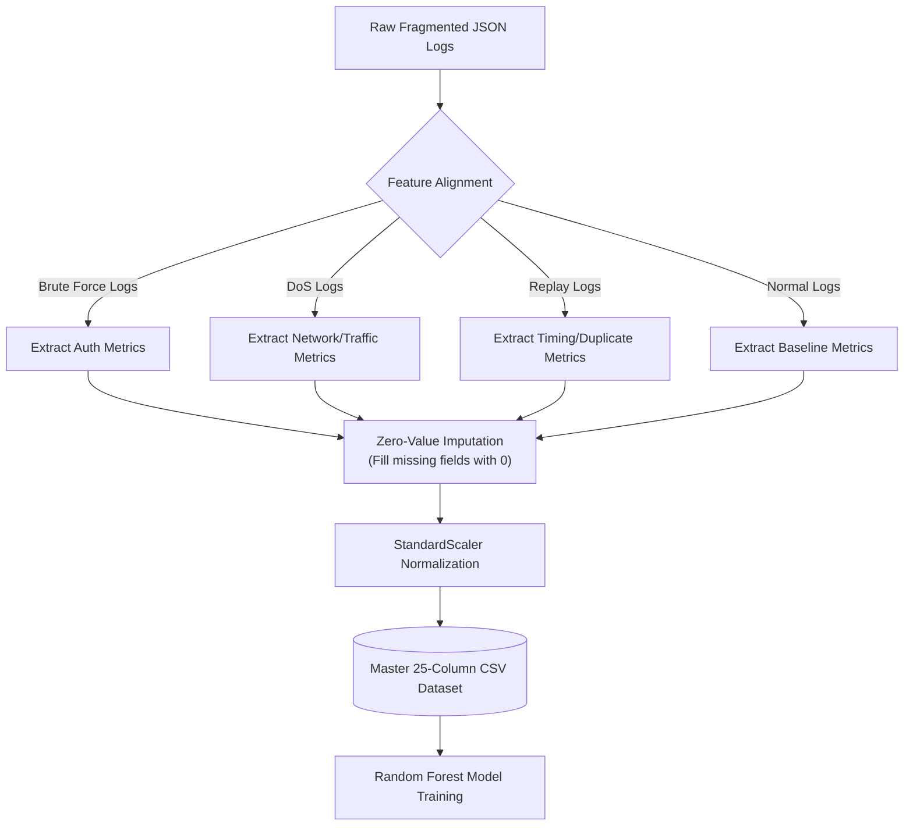

---

## 8. Machine Learning Benchmarking Workflow
*Demonstrates the scientific rigor used to select Random Forest over deep learning or linear models.*

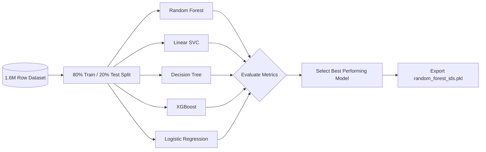

---

## 9. Random Forest Feature Importance (Conceptual Model)
*A visual representation of how the algorithm decides on an attack class.*

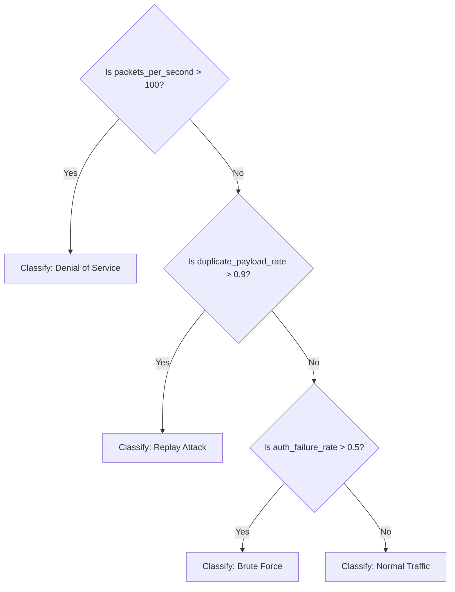

---

## 10. Active Mitigation (Live IPS) Firewall Mechanism
*Visualizes the real-time defensive mechanism implemented in Section 7.7.*

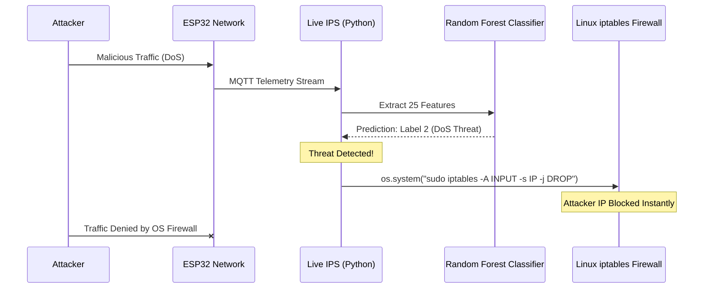

---

## 11. Full-Stack Web 3.0 Dashboard Architecture
*Illustrates the commercial-grade React/Node.js monitoring application.*

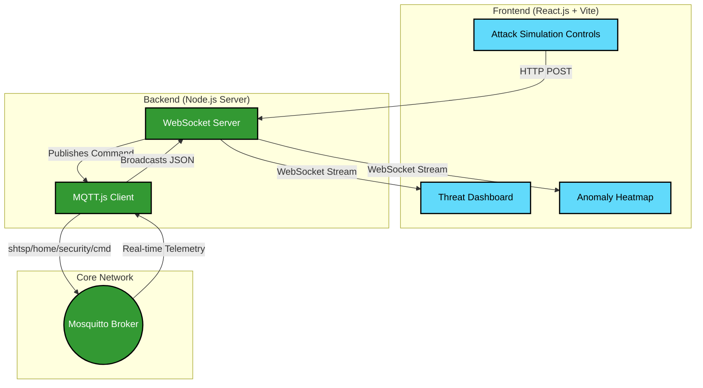

---

## 12. Brute Force Authentication Bypass Sequence
*Demonstrates how the Brute Force attack systematically exhausts credentials.*

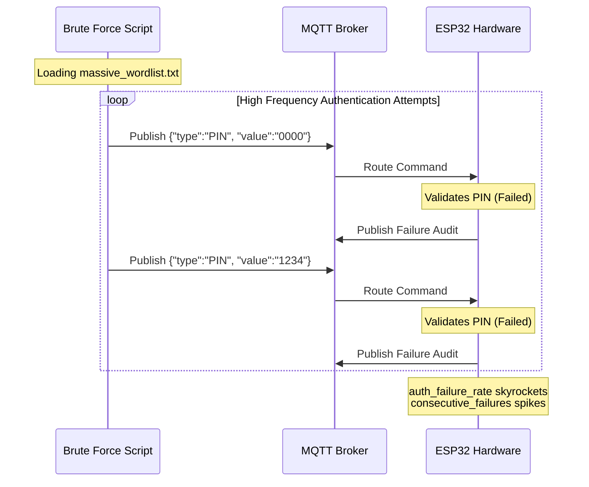

---

## 13. Normal Traffic & Authorized Communication Sequence
*Establishes the baseline "Healthy Pulse" of the smart home environment.*

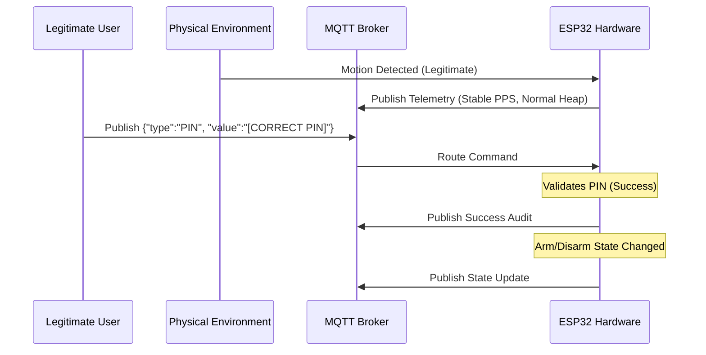

---

## 14. Research Methodology — Experimental + Design-Based Approach
*A sequential 9-step workflow detailing the project lifecycle from requirements to empirical validation.*

```mermaid
flowchart LR
    A[1. Requirements Analysis] --> B[2. Threat Modelling]
    B --> C[3. System Architecture]
    C --> D[4. Attack Simulation]
    
    D --> E[5. Dataset Engineering]
    E --> F[6. Feature Engineering]
    F --> G[7. ML Training & Benchmarking]
    G --> H[8. Dashboard + IPS Integration]
    
    H --> I[9. Testing & Validation]

    classDef teal fill:#e6f9f6,stroke:#00BC9B,stroke-width:2px;
    classDef coral fill:#fceceb,stroke:#E0405E,stroke-width:2px;
    classDef amber fill:#fff6e6,stroke:#FFC107,stroke-width:2px;
    classDef purple fill:#f5ebfa,stroke:#9C27B0,stroke-width:2px;
    classDef lime fill:#ebf9eb,stroke:#4CAF50,stroke-width:2px;

    class A,F teal;
    class B,H coral;
    class C,G amber;
    class D purple;
    class E,I lime;
```

---

## 15. System Architecture — Layered View
*A detailed architectural block diagram segregating the platform into Smart Device, Network, Security, and Dashboard layers, running parallel to the core workflow.*

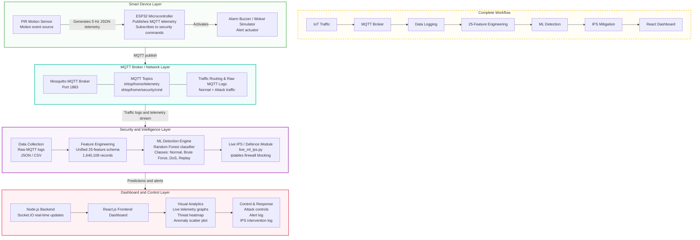

---

## 16. ER Diagram: IDS/IPS Data Model
*Entity-Relationship diagram mapping the structural relationship between devices, traffic telemetry, feature engineering, ML predictions, and automated firewall alerts.*

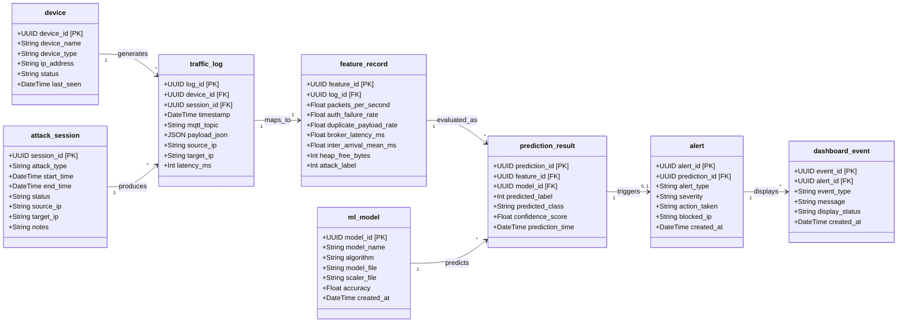
